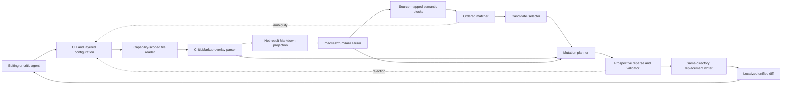

# Malarky technical design

**Status:** Draft v0.1

**Audience:** Engineers implementing Malarky and reviewers assessing its
correctness and command contract.

**Scope:** The initial command-line tool defined by the
[terms of reference](terms-of-reference.md).

**Companion documents:**

- [Domain context](context.md)
- [CLI contract](design/malarky-cli.txt)
- [Configuration example](design/malarky-config.toml)
- [Domain types](design/malarky-domain.rs)
- [Mutation matrix](design/mutation-matrix.md)
- [Development roadmap](roadmap.md)

**Last substantive revision:** 10 July 2026

## 1. Design context

Malarky lets editing and critic agents add CriticMarkup to an existing Markdown
file without reproducing the file or its surrounding prose. It must match
visible document text while preserving the original Markdown source, identify
ambiguity before mutation, and reject annotations that cross block or span
boundaries.

CriticMarkup is an overlay on Markdown rather than part of Markdown's grammar.
MultiMarkdown requires each annotation to remain within one block and warns
that crossing Markdown spans can produce invalid results. The design therefore
parses CriticMarkup and Markdown as separate, source-mapped structures instead
of treating either parser as authoritative for both syntaxes.

The first release targets UTF-8 chapters and papers under version control. It
does not render CriticMarkup, accept or reject changes in bulk, edit link
destinations, or provide an interactive editor.

## 2. Prior art and technology decisions

Pi, OpenCode, and Codex all begin with exact matching and add explicit fallback
normalizers. Pi and OpenCode reject unresolved duplicates. Pi also preserves
untouched line representation while returning a localized diff. Codex issue
30505 records how fuzzy matching can corrupt indentation when normalized
content is applied as source. Malarky adopts three consequences:

1. Match semantic text through ordered, named tiers.
2. Retain every candidate until selection is resolved.
3. Map a selected semantic range back to original source before mutation.

The design uses these Rust dependencies:

| Dependency         | Purpose                                                    | Decision                                                              |
| ------------------ | ---------------------------------------------------------- | --------------------------------------------------------------------- |
| `markdown` 1.0     | Markdown abstract syntax tree (mdast) and source positions | Required by the project; wrap it behind a parser adapter              |
| `ortho_config` 0.8 | Command parsing and layered configuration                  | Use its defaults, file, environment, and command-line precedence      |
| `similar` 3.1      | Unified success diff                                       | Use line diffs with three context lines by default                    |
| `tempfile` 3.27    | Same-directory replacement file                            | Use only behind the filesystem adapter; do not claim crash durability |

Table 1: Initial external dependencies and their bounded responsibilities.

`markdown::mdast::Node` distinguishes block, span, text, code, link, and
definition nodes and exposes unist positions. Malarky converts those offsets to
validated UTF-8 byte ranges at the adapter boundary. Multibyte fixtures must
prove that conversion before source slicing is permitted.

## 3. Correctness model

The [domain types](design/malarky-domain.rs) define half-open `SourceSpan`
ranges, source-mapped semantic segments, match candidates, annotations, and
mutation plans. The core accepts no bare integer offsets outside this boundary.

### 3.1 Semantic text

A semantic block is the searchable rendering of one Markdown block. It includes
text within paragraphs, headings, list items, block quotes, tables, code
blocks, inline code, emphasis, strong emphasis, and link labels. It excludes
link destinations, reference definitions, image destinations, front-matter
metadata, CriticMarkup delimiters, and CriticMarkup comments.

Each semantic segment carries the source span that produced it. A normalized
semantic string additionally carries a monotonic boundary map from every
normalized range back to one or more adjacent source spans. The matcher may
only return ranges that map to a contiguous source interval.

### 3.2 Net-result projection

The CriticMarkup overlay parser projects existing annotations as follows:

| Annotation  | Semantic contribution |
| ----------- | --------------------- |
| Deletion    | Nothing               |
| Insertion   | Inserted payload      |
| Replacement | New payload           |
| Highlight   | Highlighted payload   |
| Comment     | Nothing               |

Table 2: Net-result contribution of each annotation kind.

The projection also retains the complete annotation and payload source spans.
Mutation planning can therefore distinguish ordinary edits from exact inverse
operations even when the annotation's old text is absent from semantic text.

### 3.3 Containment

For any requested mutation range `R` and existing annotation or Markdown span
`S`, one of these relations must hold:

- `R` and `S` are disjoint;
- `S` contains `R` without crossing a delimiter boundary; or
- `R` fully contains `S`.

A partial intersection is invalid. A range that touches two Markdown blocks is
also invalid. Empty insertion ranges belong to exactly one semantic boundary; a
boundary between blocks is not selectable.

## 4. Architecture

Malarky uses a pipeline with a pure domain core and adapters at the command,
parser, diff, and filesystem boundaries. The core owns candidate selection,
containment checks, annotation algebra, and mutation planning. Adapters own
external representation and side effects.

Figure 1 shows the mutation path. Dashed edges return non-mutating outcomes to
the command boundary.



### 4.1 Module boundaries

The initial crate remains one package with feature-oriented modules:

- `document` owns decoding, overlay parsing, mdast adaptation, semantic
  projection, and source maps;
- `matching` owns exact and whitespace-normalized search and candidate order;
- `mutation` owns operation types, containment, inverses, and source edits;
- `commands` owns command-specific orchestration and result types;
- `config` adapts `ortho_config` into domain configuration;
- `output` formats ambiguity reports, lists, validation diagnostics, and diffs;
- `filesystem` reads and conditionally replaces files through capability-based
  directory handles; and
- `main` parses configuration, invokes one command, writes output, and maps the
  result to an exit status.

`document`, `matching`, and `mutation` contain no filesystem or terminal I/O.
They accept strings and typed values and return typed results. The command and
filesystem adapters prevent `main` from accumulating domain logic.

## 5. Parsing and semantic projection

### 5.1 Input representation

The reader records a UTF-8 byte-order mark, line-ending style, file
permissions, and file identity before parsing. Invalid UTF-8 produces exit
status 6 without creating a temporary file. Mixed line endings are preserved
because mutation edits operate on original byte ranges rather than a normalized
copy.

The filesystem adapter rejects symbolic-link input. Replacing a symlink path
would otherwise replace the link rather than its target on some platforms and
could escape the intended directory capability. The diagnostic tells the agent
to pass the resolved regular-file path.

### 5.2 Overlay parse

The overlay scanner recognizes the five CriticMarkup delimiters, escaped
delimiters, payload boundaries, and nesting. It produces an annotation interval
tree and two projections: net-result Markdown and original-result Markdown.
Every projected segment records its originating source span.

Malformed delimiters, a cross-block annotation, or an existing partial
intersection are document errors. Mutation commands and `validate` report them
before matching. `list` reports annotations only after the overlay is valid.

### 5.3 Markdown parse

The adapter calls `markdown::to_mdast` on net-result Markdown. It walks block
nodes in source order and composes mdast positions with the overlay projection
map. Definition destinations and other invisible metadata never enter semantic
segments. Container nodes contribute their visible children rather than their
raw Markdown delimiters.

The adapter checks four conditions before returning a document:

1. Every position is ordered and within the projected input.
2. Every semantic segment maps monotonically to original source.
3. Every block maps to one contiguous original-source interval.
4. Every mapped boundary lies on a UTF-8 boundary.

Failure of any condition is a parser-adapter error, not a recoverable match
failure.

## 6. Matching and selection

The matcher evaluates each semantic block independently and emits candidates in
block order, then source-offset order. `delete` and `replace` match the
concatenation of `BEFORE`, target text, and `AFTER`, but expose only the target
range. `insert` matches `BEFORE` followed by `AFTER` and exposes their shared
semantic boundary. Empty context remains valid.

The initial matcher has two tiers:

1. `exact` compares semantic text without transformation.
2. `whitespace` collapses each Unicode whitespace run to one ASCII space and
   ignores leading and trailing whitespace in the query and candidate.

The second tier runs only when the first finds no candidates. Case,
punctuation, Unicode compatibility forms, and spelling remain significant.
`--matching exact` disables the second tier.

Normalization builds a boundary map while emitting the normalized string. It
does not derive source offsets by applying normalized string indexes to the
original document. A candidate is discarded if its normalized range cannot map
to one contiguous source interval.

A sole candidate proceeds automatically. Zero candidates return exit status 3.
Two or more candidates return exit status 4 and the requested numbered report
without changing the file. `--match N` selects the stable one-based candidate;
an out-of-range index is a usage error. `--all` selects every candidate only
when their source spans and planned edits are disjoint.

## 7. Mutation algebra

The [mutation matrix](design/mutation-matrix.md) is normative. Mutation
planning receives a parsed document and selected candidates and returns either
a complete `MutationPlan` or an error. It never writes a file.

### 7.1 Operations

- `delete` wraps plain target source in `{--` and `--}`.
- `insert` inserts `{++TEXT++}` at the semantic boundary between `BEFORE` and
  `AFTER`.
- `replace` wraps old and new payloads as `{~~OLD~>NEW~~}`.
- `highlight` wraps target source in `{==` and `==}`.
- `comment` emits `{==TEXT==}{>>COMMENT<<}` for plain text and adds the comment
  after an existing highlight. Reapplying it replaces the existing comment
  payload.

`highlight --delete` removes highlight delimiters. `comment --delete` removes
only the comment, leaving any adjacent highlight intact, and rejects a supplied
comment payload. An agent that wants plain text removes the comment and then
the highlight explicitly.

### 7.2 Inverses

An inverse removes the original annotation rather than adding a
counter-annotation:

- `insert` over a deletion restores its deleted payload;
- `delete` over an insertion removes its inserted payload; and
- `replace NEW OLD` over `{~~OLD~>NEW~~}` restores `OLD`.

The operation must select the exact annotation payload through its net-result
and context mappings. Because deleted payload is absent from the net-result
view, `insert` also searches overlay deletion payloads whose surrounding
semantic context matches `BEFORE` and `AFTER`. A request that merely overlaps
the annotation is not an inverse and fails containment validation.

### 7.3 Plan application

The planner sorts disjoint `SourceEdit` values by descending start offset and
applies them to an in-memory copy. Descending order preserves all earlier
offsets. It reparses and validates the complete prospective document after all
edits; one invalid edit rejects the entire `--all` command.

## 8. CLI and configuration contracts

The [CLI contract](design/malarky-cli.txt) is normative. Mutation flags appear
after the verb, so agents can issue `malarky delete --match 1 ...` as specified
by the terms of reference.

`ortho_config` loads configuration in this precedence order:

1. command-line flags;
2. `MALARKY_*` environment variables;
3. an explicit `--config-path` or discovered `.malarky.toml` project file; and
4. built-in defaults.

The [configuration example](design/malarky-config.toml) defines the initial
keys. Unknown keys and invalid enum values are configuration errors. Command
arguments such as file paths and mutation payloads are not persistent
configuration.

Successful mutation and inspection data use standard output. Diagnostics use
standard error. The command emits no colour unless a later contract introduces
an explicit output mode; stable agent output must not depend on terminal
detection.

## 9. Inspection and validation

`list` writes one tab-separated record per annotation in source order:

```plaintext
INDEX<TAB>KIND<TAB>START_LINE:START_COLUMN<TAB>END_LINE:END_COLUMN<TAB>NET_TEXT
```

Fields escape tab, carriage return, newline, and backslash as `\t`, `\r`, `\n`,
and `\\`. Comments have an empty `NET_TEXT`. The index is stable for an
unchanged file but is not a persistent identifier.

`validate` performs decoding, overlay parsing, Markdown parsing, source-map
checks, block containment checks, and annotation-intersection checks. A valid
file writes `valid<TAB>FILE` and exits 0. An invalid file writes one diagnostic
per problem to standard error and exits 8. Validation does not create a
temporary file.

## 10. File transaction and success feedback

Mutation commands finish matching, planning, prospective parsing, and diff
generation before opening a temporary file. The filesystem adapter then:

1. opens a uniquely named temporary file in the target's directory;
2. creates it without following links;
3. copies the original file's permissions;
4. writes the prospective bytes and synchronizes the temporary file;
5. verifies that the target identity has not changed since it was read; and
6. atomically replaces the target where the platform and filesystem support
   same-directory rename.

An identity change reports a concurrent-modification error and leaves the
target untouched. Temporary-file cleanup is best effort after failure.

The initial contract provides command-level atomic replacement, not power-loss
durability. `tempfile::NamedTempFile::persist` does not synchronize the
containing directory, and cross-filesystem persistence is unavailable. The
same-directory rule avoids the latter; durable directory synchronization
remains deferred.

After replacement, `similar::TextDiff` emits a unified diff with the configured
context, defaulting to three lines. Diff paths contain the command-line file
path and no timestamps. An empty diff is an internal invariant violation
because every successful mutation must change the file.

## 11. Failure model

| Failure                                                       | Exit | Mutation                         |
| ------------------------------------------------------------- | ---: | -------------------------------- |
| Invalid arguments or configuration                            | 2    | None                             |
| No candidate                                                  | 3    | None                             |
| Multiple candidates without selection                         | 4    | None                             |
| Cross-block, partial-intersection, or invalid inverse         | 5    | None                             |
| Invalid UTF-8, CriticMarkup, Markdown, or source map          | 6    | None                             |
| Read, temporary-write, identity-check, or replacement failure | 7    | None or original target retained |
| `validate` finds document errors                              | 8    | None                             |

Table 3: Stable failure classes and file-mutation guarantees.

Every error names the file, operation, failure class, and relevant source
location. Ambiguity reports include each candidate's line, column, match tier,
and a bounded excerpt. Diagnostics never include the complete document.

## 12. Verification

The architecture has invariants that example-based tests alone do not cover.

### 12.1 Properties

1. **Preservation:** Bytes outside planned `SourceEdit` ranges are identical
   before and after mutation.
2. **Failure atomicity:** Every result other than successful replacement leaves
   the target bytes unchanged.
3. **Block containment:** Every emitted annotation maps to one mdast block.
4. **Span containment:** A mutation is disjoint from or fully contains every
   intersected annotation and Markdown span.
5. **Mapping safety:** Every semantic and normalized range maps to ordered
   UTF-8 source boundaries.
6. **Inverse law:** Applying an operation and its defined inverse restores the
   exact original bytes.
7. **Determinism:** Equal document bytes, arguments, and configuration produce
   equal ordered candidates and output.
8. **All-or-nothing selection:** `--all` applies every selected plan or none.

Property-based generators should produce Markdown block trees, Unicode text,
whitespace variants, CriticMarkup overlays, and intersecting source ranges.
Shrunk failures must retain the violated relation, particularly for multibyte
boundaries and nested spans. A small reference interpreter over generated
plain-text blocks can check net-result and inverse laws independently of the
production planner.

### 12.2 Combination surface

The behavioural matrix crosses mutation verb, exact or whitespace match,
zero/one/many candidates, `--match`/`--all`, plain or annotated targets, valid
or partial intersections, and write success or failure. Pairwise coverage is
acceptable for independent combinations, but every exit status, inverse pair,
and intersection relation requires a direct scenario. Snapshot tests may lock
the CLI, ambiguity, list, validation, and diff formats after semantic
assertions verify their content.

Filesystem fault injection must cover short writes, synchronization failure,
target identity change, rename failure, and cleanup failure. The design does
not claim power-loss durability, network-filesystem rename atomicity, or safety
against an administrator changing paths outside the opened directory capability.

## 13. Alternatives and deferred decisions

Raw-source matching was rejected because Markdown syntax and link destinations
would become visible to agents. Rendering the whole document and diffing it
back was rejected because it cannot preserve unrelated source formatting.
Unbounded edit distance was rejected for the initial release because it makes
candidate qualification harder to explain and raises the risk of a unique but
incorrect match.

The design defers punctuation, case, Unicode-compatibility, and spelling
normalizers; machine-readable JSON output; persistent annotation identifiers;
non-UTF-8 input; symlink following; book-length performance guarantees; and
power-loss durability. Each requires a new contract or evidence rather than an
unannounced matcher fallback.

## References

- CriticMarkup syntax and limitations,
  <https://fletcher.github.io/MultiMarkdown-6/syntax/critic.html>.
- Rust `markdown` crate,
  <https://docs.rs/markdown/1.0.0/markdown/>.
- Pi edit matching and diff utilities,
  <https://github.com/earendil-works/pi/blob/main/packages/coding-agent/src/core/tools/edit-diff.ts>.
- OpenCode edit tool,
  <https://github.com/anomalyco/opencode/blob/dev/packages/opencode/src/tool/edit.ts>.
- Codex `apply_patch` matcher,
  <https://github.com/openai/codex/blob/main/codex-rs/apply-patch/src/seek_sequence.rs>.
- Codex fuzzy-matching corruption report,
  <https://github.com/openai/codex/issues/30505>.
- OrthoConfig,
  <https://github.com/leynos/ortho-config>.
- `similar::TextDiff`,
  <https://docs.rs/similar/3.1.1/similar/struct.TextDiff.html>.
- `tempfile::NamedTempFile`,
  <https://docs.rs/tempfile/3.27.0/tempfile/struct.NamedTempFile.html>.
